## Background

Motivation: use visualisation to explain statistical modelling ideas

Audience

 - non-statisticians
 - non-programmers
 
Technology

 - interactive graphics
 - easily accessible

## Existing Approaches

Some demos available in rpanel and TeachingDemos, e.g. rp.regression

<div class = "centered">
```{r fig.height=3.5, echo = FALSE}
library(png)
library(grid)
img <- readPNG("rp.png")
 grid.raster(img)
```
</div>

- not extensive enough
- need to start from R

## Plan

Suite of apps

 - linear modelling
 - generalized linear modelling
 
Implement using shiny

 - quick to build
 - can access through browser
 - can embed in interactive documents, e.g. ioslides presentation
 
## linreg App

Adjust intercept and slope (as in rp.regression)

- simultaneously visualise minimising loss function

Show fitted density, not just $\hat{y}$, c.f. GLM post on freakonometrics:

<div class = "centered">
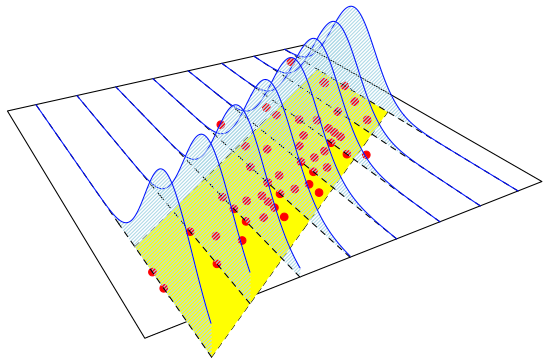
</div>

<footer class="source">http://freakonometrics.hypotheses.org/9593</footer>

---

<div style = "margin-left: -50px; margin-right: -50px">
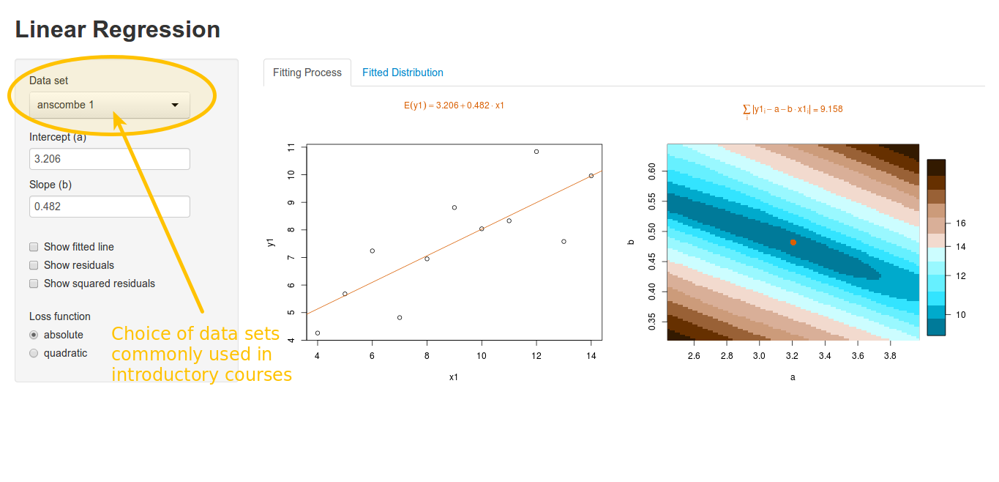
</div>

---

<div style = "margin-left: -50px; margin-right: -50px">
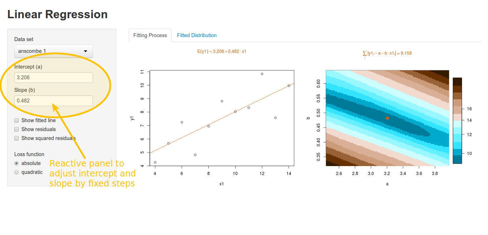
</div>

---

<div style = "margin-left: -50px; margin-right: -50px">
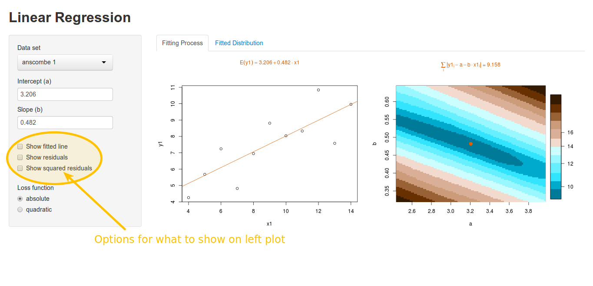
</div>

---

<div style = "margin-left: -50px; margin-right: -50px">
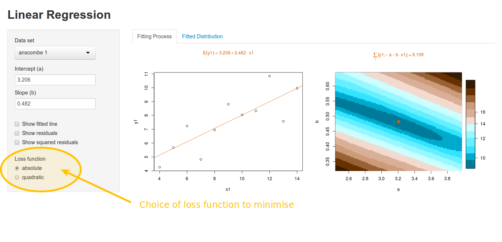
</div>

---

<div style = "margin-left: -50px; margin-right: -50px">
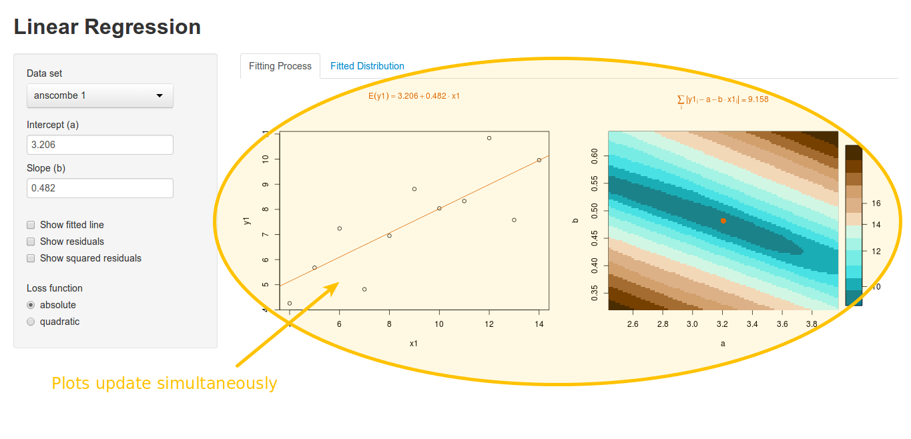
</div>

---

<div style = "margin-left: -50px; margin-right: -50px">
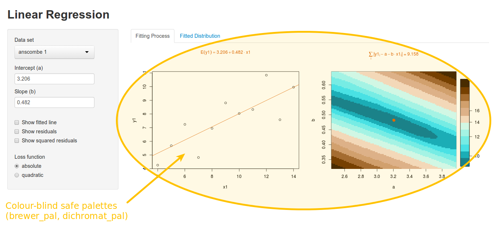
</div>

---

<div style = "margin-left: -50px; margin-right: -50px">
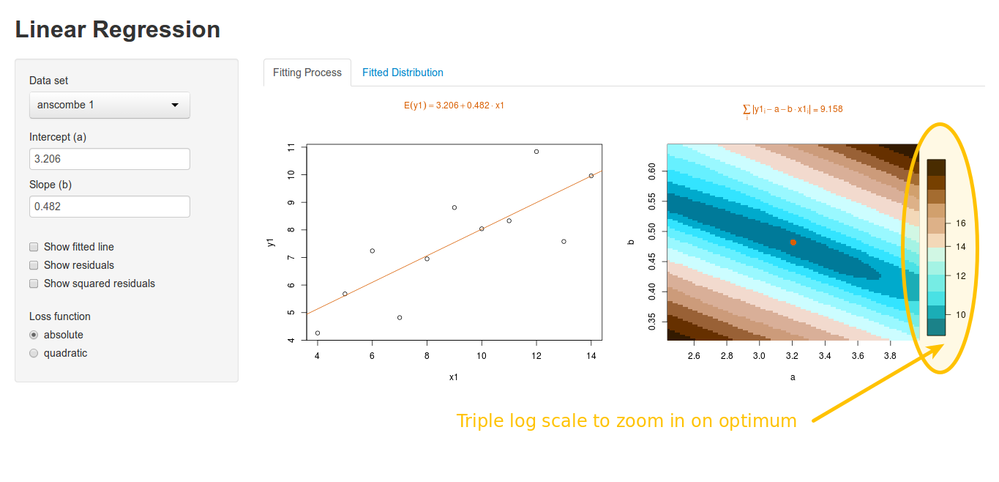
</div>

---

<div style = "margin-left: -50px; margin-right: -50px">
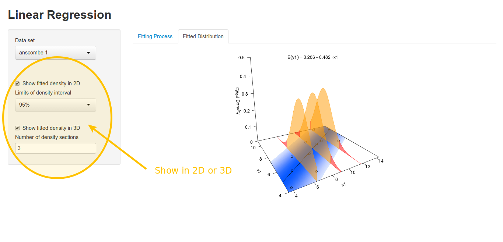
</div>

---

<div style = "margin-left: -50px; margin-right: -50px">
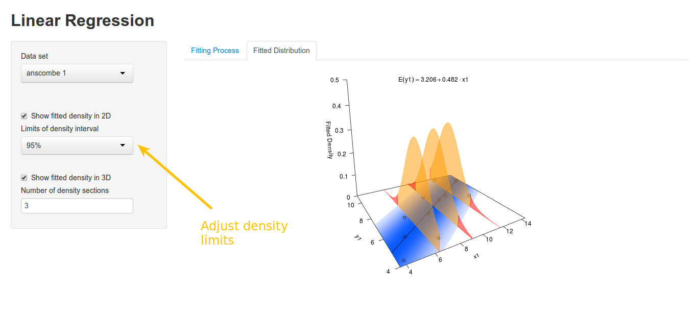
</div>

---

<div style = "margin-left: -50px; margin-right: -50px">
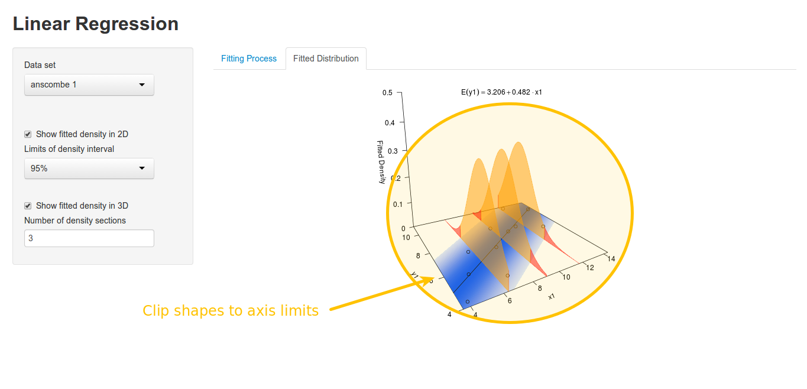
</div>

---

<div style = "margin-left: -50px; margin-right: -50px">
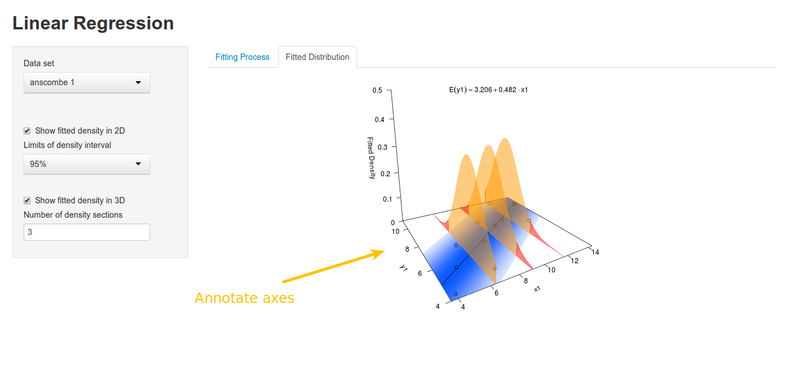
</div>

---

<div style = "margin-left: -50px; margin-right: -50px; margin-top: -50px">
```{r, echo=FALSE}
shinyAppDir(
  "linreg",
  options=list(
     width="100%", height=600
  )
)
```
</div>

<footer class="source">runGitHub("shiny-demos", username = "hturner", subdir = "linreg/")
</footer>

## Creating 2D density

```{r, echo = FALSE}
inputPanel(
    radioButtons("npoly", "Number of polygons:", 
                 choices = list("3" = "three", "50" = "fifty"), selected = "three", 
                 inline = TRUE),
    uiOutput("display")
)

output$display <- renderUI({
    m <- switch(input$npoly, "three" = 3, "fifty" = 50)
    sliderInput("nshow", "Number of polygons to show:", 
                min = 0, max = m, value = 0, 
                animate = TRUE)
    })

div(align = "center",
renderPlot(height = 350, width = 400, expr = {
    mod <- lm(cars$dist ~ cars$speed)
    plot(dist ~ speed, data = cars, type = "n")
    xlim <- par()$usr[1:2]
    x2D <- seq(xlim[1], xlim[2], length.out = 3)
    y2D <- coef(mod)[1] + coef(mod)[2] * x2D
    # add density strip with the specified number of polygons
    if (length(input$nshow) && input$nshow > 0){
        m <- switch(input$npoly, "three" = 3, "fifty" = 50)
        denStripTmp(x2D, y2D, summary(mod)$sigma, perc = 95, 
                    col =  dichromat_pal("BluetoOrangeRed.14")(14)[1],npoly = m,
                    nstop = input$nshow)
    }
    points(dist ~ speed, data = cars)
}))

options = list(height = 450)
```

---

<div style = "margin-left: -50px; margin-right: -50px; margin-top: -50px">
```{r, echo=FALSE}
shinyAppDir(
  "linreg3",
  options=list(
     width="100%", height=700
  )
)
```
</div>

<footer class="source">runGitHub("shiny-demos", username = "hturner", subdir = "linreg3/")
</footer>


## poisreg App

Aim: produce equivalent app to linreg for poisson regression

Difficulties

- how to visualize residuals?
- how to show 2D/3D mass?

Additional features

 - allow to separately specify the variance function and the link function?
 
## Weighted raw residuals

Represent pearson residuals as raw residuals $\times$ weight

<div class = "centered">
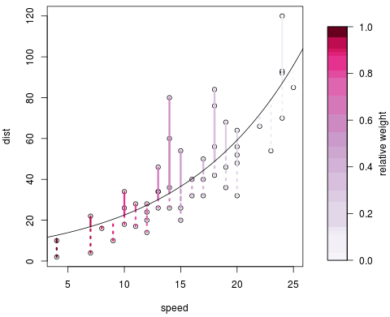
</div>

---too complicated!

## Pearson residuals - lines

<div class = "centered">
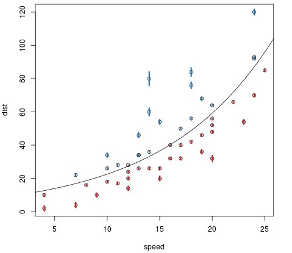
</div>

---little visual impact

## Pearson residuals - circles

<div class = "centered">
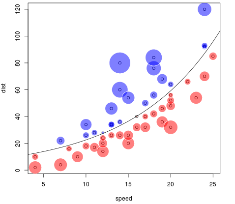
</div>

---better!

## Fitted mass

<div class = "columns-2">

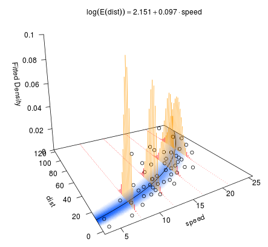

3D slices now made of segments vs. polygons

2D mass represented by binned density over grid

- use image for 2D 
- use image3D for 3D from plot3D package
</div>


## Summary

linreg app complete, test version hosted by the University of Plymouth: http://141.163.66.244:3838/linreg/

 - domain name to follow
 - other apps to be added when complete

Development versions of all apps at https://github.com/hturner/shiny-demos

 - linreg
 - linreg3 (leave-one-out residuals)
 - poisreg

Markdown for this presentation also on Github repository and presentation deployed at https://supershiny.shinyapps.io/useR2014talk/